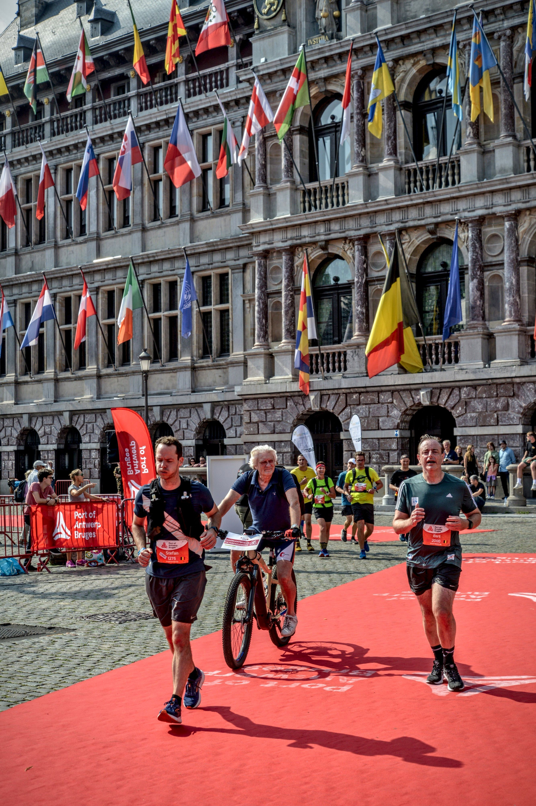

---
categories:
  - persoonlijk
  - lopen
date: 2022-09-13 19:11:01 +0100
excerpt: Op zondag 11 september stond mijn tweede marathon op de planning. Een realistische doelstelling en een inzinking later ben ik toch trots op mijn 2de finish op rij.
tags:
  - lopen
  - marathon
  - Antwerp Marathon
title: 2de marathon - 2de finish
url: /2022/09/13/2de marathon - 2de finish/
---

Op zondag 11 september was het zo ver, de start van mijn tweede marathon. De doelstellingen aangepast en realistischer gemaakt, of dat dacht ik toch. 6min/km over 42,195km, dan kom je op een tijd van 4u12 en loop ik een stevig PR.

In tegenstelling tot vorige keer, waar het minder begon te gaan op km 30, begon de miserie nu vroeger. Een misselijk gevoel, geen extra calorieën meer binnenkrijgen en dan volgt de spreekwoordelijke man met de hamer snel. Hier ga ik toch op moeten trainen voor een volgende marathon.



De inzinking was zo groot dat ik na 30km wou stoppen. Gelukkig kon ik rekenen op mijn supporters om toch door te zetten. 12km kunnen lang zijn, gelukkig was Bart De wever zo vriendelijk om samen met mij op de foto te gaan aan het stadhuis en zo strompelde we verder richting finish.

Aan de finish stonden Kristl en Emiel me op te wachten met een leuke verrassing. Emiel was op’t parcours gekomen en samen liepen we de laatste meters tot aan de finish.



Mijn eindtijd: <b>4u 51 minuten en 32 seconden</b>  
Geen PR, wel blij met mijn 2de finish op rij. 
 
Next up: <a href="https://www.nnmarathonrotterdam.nl">De Mooiste</a>.

Photo credits <a href="https://www.sportograf.com">Sportograf.com</a>
