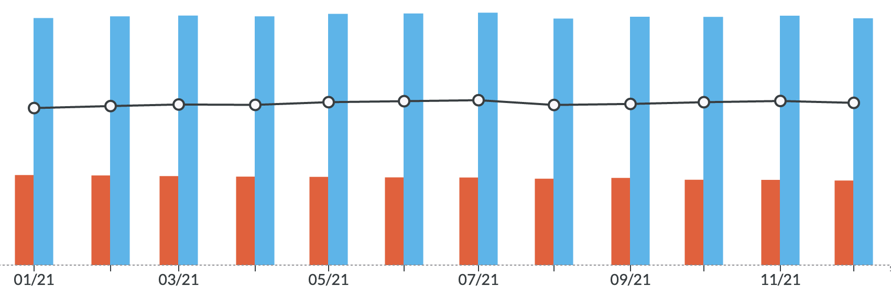

---
categories:
  - budget
date: 2022-01-24 10:11:01 +0100
excerpt: Het is alweer een tijd geleden dat ik hier nog iets over YNAB gepost heb. Vandaar dat ik even een korte terugblik wil werpen op 2021 en ons financieel jaar.
tags:
  - budget
  - YNAB
title: Closing 2021
url: /2022/01/24/Closing 2021/
---

Het is alweer een tijd geleden dat ik hier nog iets over [YNAB (Referral)](https://ynab.com/referral/?ref=nK4-awM84GDPqxy7&utm_source=customer_referral) gepost heb. Vandaar dat ik even een korte terugblik wil werpen op 2021 en ons financieel jaar.

### Grote, extra uitgaven:
Vorig jaar hebben we geïnvesteerd in ons huis en dat staat dit jaar ook weer op de planning. Het dak was dringend aan vernieuwing toe en het was het laatste jaar waarin zonnepanelen nog een iets of wat interessante investering waren.

Emiel groeide stilaan uit zijn bed dus was er voor hem een nieuwe slaapkamer.



Op’t einde van het jaar zijn we de kerstsfeer in [Disneyland Parijs]( "Disneyland Parijs") gaan opsnuiven en ondertussen hebben we alweer een nieuwe reis gepland (en een voorschot betaald) voor komende zomer.

### Net growth
Ondanks deze uitgaven hebben we onze net worth toch kunnen laten groeien met 3,3%. Een groot deel komt natuurlijk doordat de investeringen de waarde van ons huis doet omhoog gaan en een dalende hypothecaire lening waardoor onze schuld kleiner wordt.
