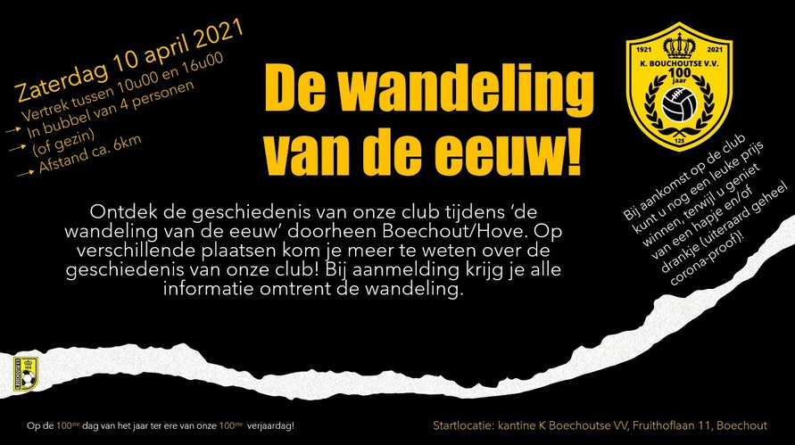

---
categories:
  - persoonlijk
date: 2021-04-11 16:11:01 +0100
excerpt: Om de 100ste verjaardag van [K. Boechoutse V.V.](https://www.boechoutsevv.be) te vieren werd er op de 100ste dag van het jaar de Wandeling van de Eeuw georganiseerd.
tags:
  - wandelen
  - K. Boechoutse V.V.
  - voetbal
  - Emiel
title: Wandeling van de eeuw
url: /2021/04/11/Wandeling van de eeuw/
---

Om de 100ste verjaardag van [K. Boechoutse V.V.](https://www.boechoutsevv.be) te vieren werd er op de 100ste dag van het jaar de Wandeling van de Eeuw georganiseerd. Tijdens deze wandeling kon je de geschiedenis van de club ontdekken.

We vertrokken langs het B en C veld waar de vroegere kleedkamers waren in wat nu het materiaalkot is. Uiteraard zonder stromend water. De tweede stop op de wandeling was bij Marcel, de trouwste en oudste supporter van den Boechoutse en naar wie het [champagnebier](https://www.boechoutsevv.be/kbvv-shop-1/marcelleke) is vernoemd. Na de supporters kwamen nu de oprichters en voorzitters aan de beurt. Kinderdagverblijf “De Kleine Berg” was vroeger een café en waar richt je een voetbalploeg op, uiteraard.



De volgende stops aan de dreef en de molen tonen plaatsen waar de club nog gespeeld heeft om daarna de vrijwilligers te eren en terug op de club aan te komen. Op de club konden we coronaproof genieten van een hapje en een drankje, al moesten we eerder schuilen voor de regen.

Een topwandeling georganiseerd door een topclub en topteam!

